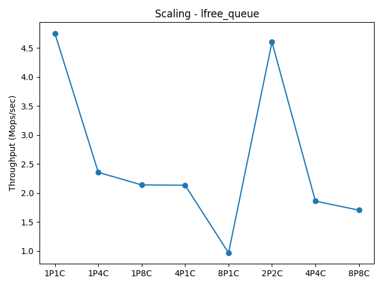
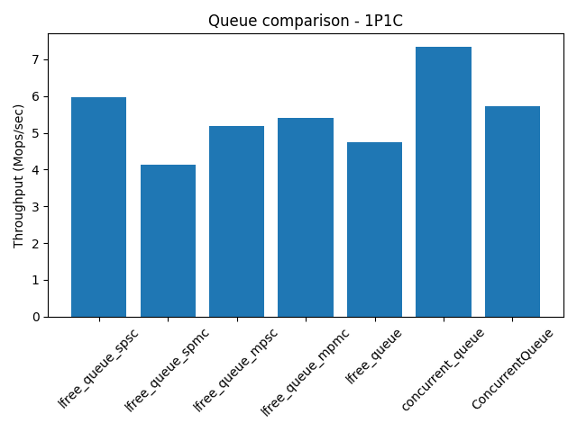
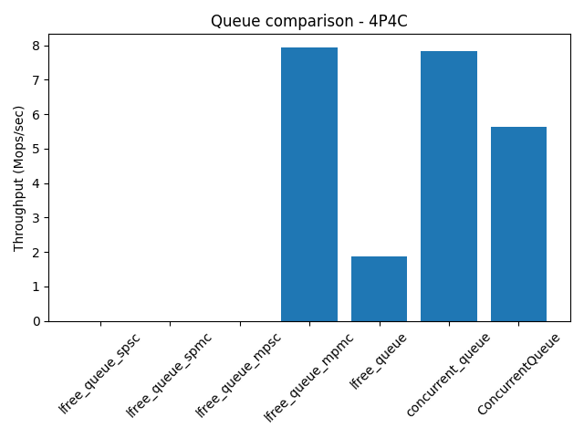
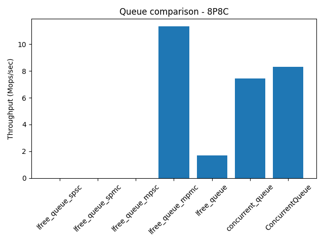
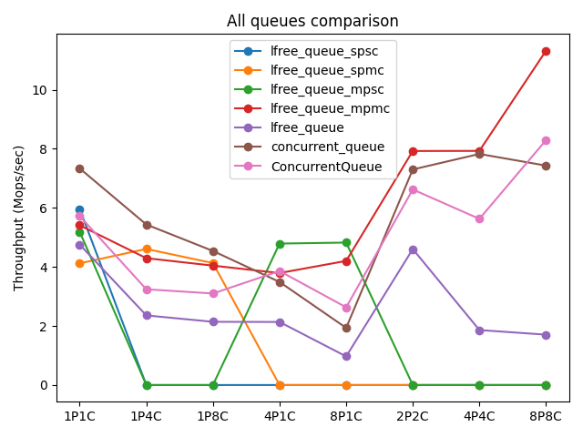

# Lock-Free Queue 

[🇨🇳 中文版 (Chinese)](./README_zh.md) | [🇺🇸 English](./README.md)

---

一个用于 C++ 开发的高性能无锁队列实现库.

如果你需要无锁队列, 并且使用场景明确(有确定数量的数据生产者和确定数量的数据消费者), 那你可以看看本项目

## 特征
- 快,在特定的场景下使用特定的队列,可以得到极致的速度
- 小,单头文件,只需要将头文件包含到你的项目中即可
- 极简实现,简单,实现逻辑透明简单,如果你对无锁编程有了解,你完全可以修改源码,针对你需要的场景进行优化
- 完全的线程安全,无锁的队列,
- 只要C++11的版本即可使用
- 无任何第三方依赖

## 核心功能

本项目实现了 6 个队列, 它们分别是
- `lfree_queue`: 最基本的无锁队列,
- `lfree_queue_spsc`: 专用于单生产者单消费者的队列
- `lfree_queue_spmc`: 用于单生产者多消费者的队列
- `lfree_queue_mpsc`: 用于多生产者单消费者的队列
- `lfree_queue_mpmc`: 用于多生产者多消费者的队列
- `concurrent_queue`: 用于不限定生产者消费者数量的队列


## 队列设计


### `lfree_queue` 

`lfree_queue`是一个环形队列, 用cas的思想来实现无锁访问,但是在生产者和消费者数量大的情况下,cas竞争就会很严重,每一次只有一个线程可以cas竞争成功,导致性能的下降(下图是在生产消费5000000条数据,循环5次在不同的生产者和消费者数量的平均测试结果).



于是,我就萌发了对不同场景的队列进行分开设计的想法,场景确定的话,设计起来就很简单了,当然区分场景定义的队列,肯定要合理使用,如果不按照创建的时候确定的消费者和生产者数量进行使用的话,就会assert结束程序

### `spsc`
对于 `lfree_queue_spsc` 来说,只需要控制操作是原子的就可以了,不需要同侧的cas

### `mpsc`
`lfree_queue_mpsc` 的设计,每一个生产者一个队列,消费者轮训消费,那么它内部就是N个 `spsc` 队列,我在实现中也确实是这样做的

### `spmc`
对于 `lfree_queue_spmc` 来说,我的设计思路是每一个消费者一个队列,消费的时候从自己的这个队列中去消费.

最初的设计复用的也是 `spsc` 队列,但是因为想着以后可能会扩展消费者的任务窃取,所以去实现了一个最原始的无锁队列,也就是 `lfree_queue`, 并把它复用到 `lfree_queue_spmc` 队列中,这样的话,也不需要在 `lfree_queue_spmc` 队列中进行 `cas` 操作了, 对于每一个消费者来说,他们拥有的是一个一对一的简单无锁队列,多消费者的原因,可以分散单个 `lfree_queue` 的 `cas` 操作,从而提高性能

在刚开始的是有想过去设计任务窃取,但是刚开始写,想着先写一个完整的队列,之后再去完善优化,结果在我测试的时候发现,如果没有任务窃取,那么如果消费者退出了,或者不再来消费了,那么专属于他的那个队列中的任务,就永远得不到消费了,所以补上了一个简单的任务窃取的补丁,想的是一般情况下不需要过量的任务窃取,那样会影响性能.

### `mpmc`
`lfree_queue_mpmc` 的设计, 也是基于一个生产者一个队列的思想, 消费者可以去轮训生产者的队列进行消费.

那么我这里选择的是 `lfree_queue_spmc` 队列, 作为生产者的队列, 为什么这么设计呢, 这是在我之前写的一版 `lfree_queue` 的时候使用的思路, 当时为什么写 `lfree_queue` ,又是因为我当时在写自己的日志类,哈哈,这里扯远了,也就是说这个思路在一年前就已经诞生了,只不过当时写的比较潦草, 最近有时间了, 想要重构我的无锁队列, 所以才有了这个项目

```txt
        consumer    consumer    consumer    consumer
            \           |         |         /
               \        |         |      /
                    lfree_queue_mpmc
    {          /                        \                  }
    {       /                                \             }
    {    lfree_queue_spmc  --        -- lfree_queue_spmc   }
    {   {       |         } |        | {       |         } }
    {   {   lfree_queue   } |        | {   lfree_queue   } }
    ========================|========|======================
            producer   <-----        ----->  producer
```

生产者的生产是给自己的队列中的N个消费者的队列轮训插入的, 消费者的消费是从生产者中属于自己的那个队列中消费的,至此,生产者有自己的队列,消费者也有自己的队列,生产者和消费者都极大程度的避免了同步竞争.

但是在这个队列的设计上, 定义了太多的队列了,生产者有自己的队列, 消费者在每一个生产者的队列中都有一个自己的队列, 所以在这个队列的使用上, 可以指定尽量小一些的队列长度,

### `concurrent_queue`

之前的四个专属场景的队列, 他们在各自场景下的性能发挥是稳定的, 但是有一定的局限性, 如果在一些场景下,不确定消费者和生产者的情况下, 就无法使用以上的队列.

对于`lfree_queue`队列来说,他虽然可以在不确定生产者和消费者的数量的情况下使用,但也仅限于在数量比较少的情况下, 如果数量一旦多起来,那么他的性能就会变得很差.

所以`concurrent_queue`就诞生了, 它也是对于`lfree_queue`的复用, 但是设计思想和上面的几个队列完全不一样.

在 `mpsc`, `spmc`, `mpmc` 队列中 ,选择提高 `cas操作` 成功率的方式是给每一个线程一个局部队列, 但是在 `concurrent_queue` 设计的时候, 初衷就是为了不依赖线程数量, 而提高性能, 所以就不能采用每一个线程一个局部队列的方式. 

所以在`concurrent_queue`的设计中, 是采用 `分段cas` 的策略,  我将每一`段`都替换成了`lfree_queue`, 然后对于每一段, 想要在这一段中进行生产或者消费, 那么你必须先cas竞争这一段的使用权. 

值得注意的是, 在段的竞争上, 并不是严格的竞争, 是比较宽松的规则, 这就可能导致多个线程还是在同一个段上cas, 所以段的个数 N, 就比较讲究了, 如果 N 的大小设置的合适的话,是可以大大降低同一个段上的 cas 的成功率的, 但是也不能太大.

在实现中, N 的大小是机器的核心数, 但是你可以在构造队列的时候, 为其传递参数, 来设定段的个数, 在我的初步测试过程中, 发现如果段的数量在访问线程的 2 到 3 倍, 性能为最佳, 使用过程中, 以实际测试为准, 如果有小伙伴测试出最佳的 N 的值,也可以辛苦反馈一下. 

## 接口设计

定义的六个队列都有同样的接口

```C++
construction(/*mp*/int producer_n, /*mc*/int consumer_n, size_t queue_size);
template<typename U>
bool try_put(U&& data);
bool try_get(T& data);
size_t size_approx();
```

每个队列的使用代理样例在 simple/ 目录下, 编译之后即可执行运行
```bash
cd simple; mkdir build; cd build;
cmake ..; make
./queue/queue_test
./spsc/spsc_test
./spmc/spmc_test
./mpsc/mpsc_test
./mpmc/mpmc_test
```

`lfree_queue_mpmc` 使用示例

```C++
#include <lockfree.hh>

int main() {
    lockfree::lfree_queue_mpmc<int> q(2,2);
    std::atomic<size_t> count_p { 0 };
    std::atomic<size_t> count_c { 0 };
    auto producer_back = [&q,&count_p](){
        for(int i = 1; i <= 10000; i++) {
            if(!q.try_put(i)){
                std::this_thread::yield();
                i--;
                continue;
            }
            count_p += i;
        }
    };
    std::thread producer1(producer_back);
    std::thread producer2(producer_back);
    auto consumer_back = [&q,&count_c](){
        int data = 0;
        for(int i = 1; i <= 10000; i++) {
            if(!q.try_get(data)){
                std::this_thread::yield();
                i--;
                continue;
            }
            count_c += data;
        }
    };

    std::thread consumer1(consumer_back);
    std::thread consumer2(consumer_back);

    producer1.join();
    producer2.join();
    consumer1.join();
    consumer2.join();
    
    assert(q.size_approx() == 0);
    assert(count_p == count_c.load());
    return 0;
}
```

## 性能测试

###  测试环境

至于性能测试,我是在我的小mini上测试的,他的配置已经系统信息:

- 系统: ubuntu22.04 STL
- 内存: 16 gb
- CPU: 12 核心

既然是性能测试,本项目又是基于不同的场景下开发的无锁队列,所以我分别是在下面的不同场景下进行的测试

- 1P1C
- 1P4C
- 1P8C
- 4P1C
- 8P1C
- 2P2C
- 4P4C
- 8P8C

参与测试的队列有以下列举的队列, cameron314/concurrentqueue 作为一个 C++ 的 工业开发级别的无锁队列库,本着学习的态度和大佬的队列进行对比

- `lfree_queue_spsc`
- `lfree_queue_spmc`
- `lfree_queue_mpsc`
- `lfree_queue_mpmc`
- `lfree_queue`
- `concurrent_queue`
- `cameron314/concurrentqueue`

测试条件说明:

生产消费 `5000000` 条数据并计时, 重复这个操作 `5` 次, 取平均值进行统计


### 测试结果

我自己测试的数据,也放到了项目中,[测试结果目录](./test/result/),并且用将这些目录,制作成了表格和曲线图的形式.

在此文件中,只放了部分图表信息, 如果有兴趣了解, 可以去[结果图标目录](./test/result/plots/)中去查看

1P1C 性能对比



~4P4C 性能对比



~8P8C 性能对比



汇总数据



### 性能对比说明
* **对比对象**: `ConcurrentQueue` (由 [cameron314](https://github.com/cameron314) 开发)
* **测试方法**: 通过 [`src/adapter.hh`](./test/src/adapter.hh) 统一接口，在相同的硬件环境下执行压力测试。
* **数据来源**: 所有的对比原始数据均记录在 [`test/result/`](./test/result/) 目录下。

## 致谢与参考 (Acknowledgements)

本项目在测试过程中使用了以下优秀的开源库：

* **[cameron314/concurrentqueue](https://github.com/cameron314/concurrentqueue)**: 业界领先的高性能无锁队列实现。本项目在基准测试中将其作为性能标杆进行对比。


## 开源协议 (License)

本项目采用 [Apache License 2.0](./LICENSE) 协议开源。